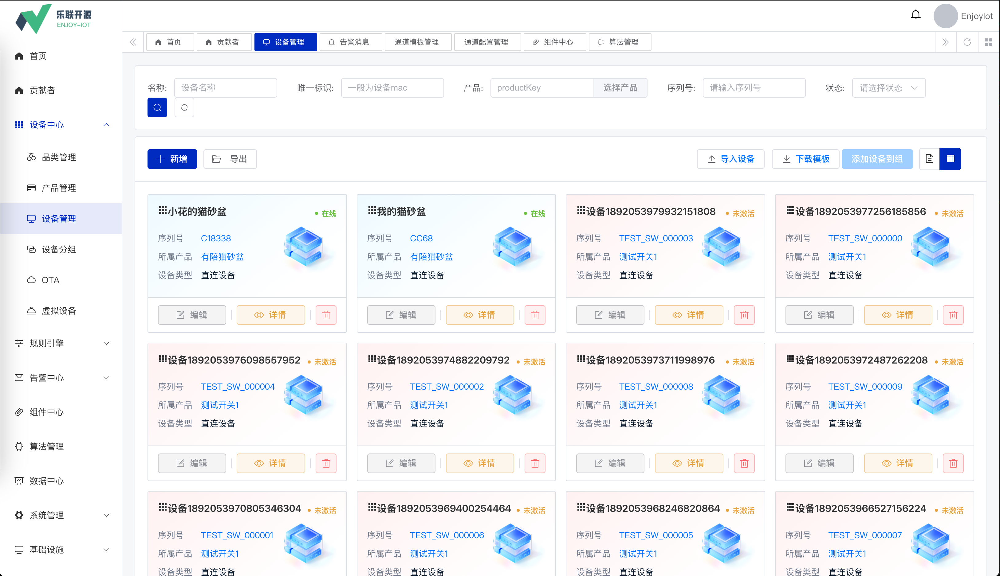
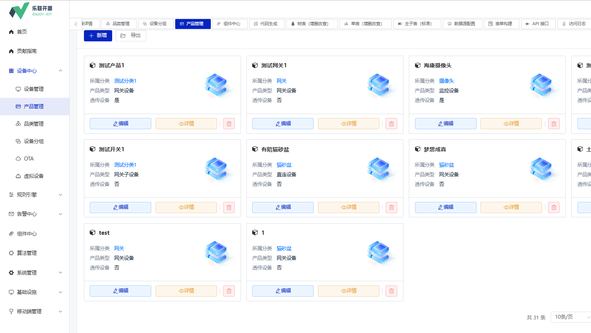
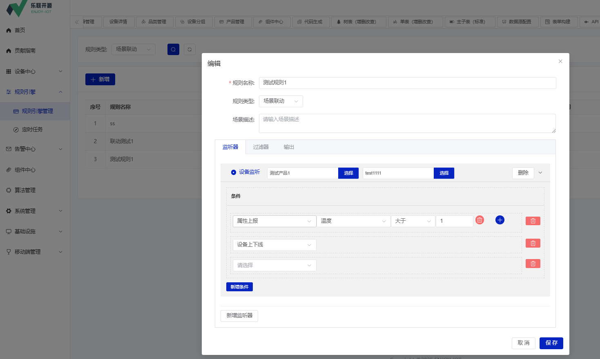
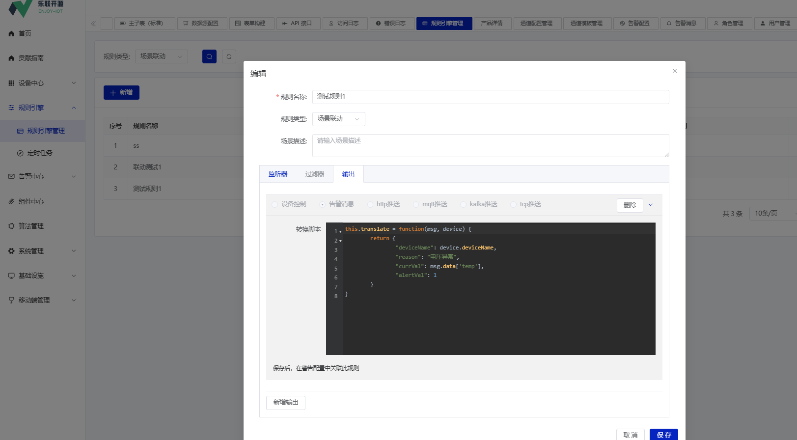
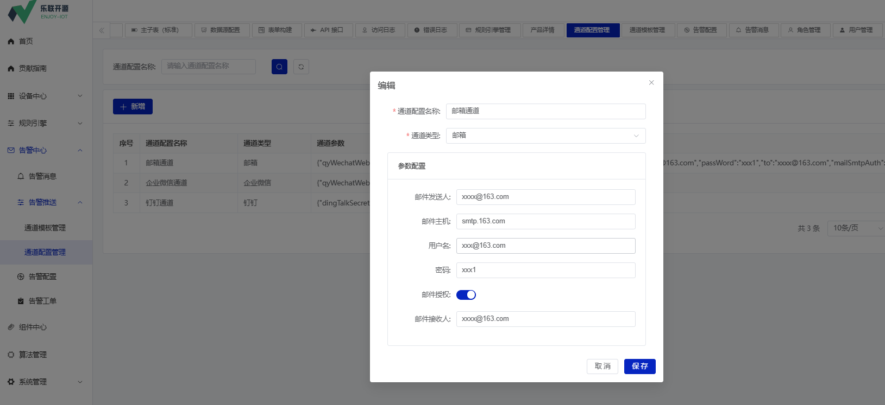
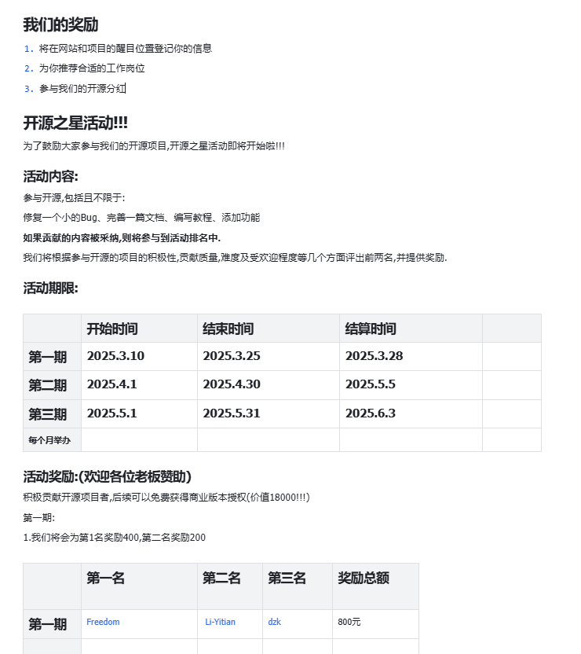

<p align="center">
 
 
</p>


## 平台简介


> 有任何问题，或者想要的功能，可以在 _Issues_ 中提交。
>
> 😜 给项目点点 Star 吧，这对我们真的很重要！

### 平台通用基础功能
* 基于若依通用后台管理系统开发
* 采用 Spring Boot 多模块架构、MySQL + MyBatis Plus、Redis + Redisson
* 数据库默认使用 MySQL，其它数据库后续进行适配
* 消息队列可使用 Event、Redis、RabbitMQ、Kafka、RocketMQ 等
* 权限认证使用 Spring Security & Token & Redis，支持多终端、多种用户的认证系统，支持 SSO 单点登录
* 支持加载动态权限菜单，按钮级别权限控制，Redis 缓存提升性能
* 高效率开发，使用代码生成器可以一键生成 Java、Vue 前后端代码、SQL 脚本、接口文档，支持单表、树表、主子表
* 集成阿里云、腾讯云等短信渠道，集成 MinIO、阿里云、腾讯云、七牛云等云存储服务

### 平台物联网功能
* 品类管理-树型结构品类管理，内置常见物联网设备品类
* 产品管理-提供产品基本信息设置、物模型定义、产品发布管理、数据解析等
* 设备管理-基础管理功能（注册、分组、标签等）、运行监控、远程控制、安全管理、数据管理等
* 设备接入-提供mqtt/http/modbus/udp/coap等常见协议接入、设备认证、接入配置、连接管理、OTA等
* 组件中心-基于Spring Boot的设备协议接入模块，可实现动态配置、多实例独立部署
* 规则引擎-数据处理规则、触发条件、执行动作、规则配置、运行管理、场景应用等
* 告警中心-告警规则配置、告警通知、告警处理、告警监控、告警联动等
* 数据管理-提供实时数据存储、历史数据时序数据库存储、数据查询分析、数据推送等
* 另提供可视化大屏、第三方平台对接、视频接入、无人机接入、AI算法集成等功能


### 前端仓库
[](https://gitee.com/open-enjoy/enjoy-web)

### 界面展示







### 文档

在线文档：[https://y5yrmmjjns.feishu.cn/wiki/M7Fgw1DX2iCbKNk5ucDcZ5mhnfd](https://y5yrmmjjns.feishu.cn/wiki/M7Fgw1DX2iCbKNk5ucDcZ5mhnfd)

演示系统：见微信群公告

### 近期开发计划
#### 1.添加esp32-xiaozhi后台支持
小智后台管理功能
1. 智能体管理
2. 模型配置


### 开源之星活动

快来参与开源活动,有现金奖励哦!!!
https://y5yrmmjjns.feishu.cn/wiki/PsPEwXms0iJEayk88Wgc4xH1nob?fromScene=spaceOverview



#### 提交pr
请提交到dev分支

####  git 提交规范
示例: 
feat(xiot):新增jt808协议支持
```angular2html
feat：新功能（feature）
fix：修补bug
docs：文档（documentation）
style： 格式（不影响代码运行的变动）
refactor：重构（即不是新增功能，也不是修改bug的代码变动）
test：增加测试
chore：杂项,构建过程或辅助工具的变动,如更新依赖库
perf: 性能优化
test: 添加或修改测试
build: 构建系统或外部依赖项的变更
ci: 持续集成配置的变更
revert: 回滚
```

## 联系我们

 乐联开源商务及技术联系

 **添加微信，备注：进群**


商务咨询


开源版：代码完全开源；
> 如果您将此项目用于商业用途，请遵守 Apache2.0 协议并保留作者技术支持声明。
>
> 二次开发如用于商业性质或开源竞品请不要删除和修改源码头部的版权与作者声明及出处
>
> 允许进行商用，但是不允许二次开源出来并进行收费

商业版：可移除作者署名
https://y5yrmmjjns.feishu.cn/wiki/FlxmwXzQJiEKCJkGuIhcLsyjnwh?fromScene=spaceOverview 

## :fa-chain-broken: 友情链接

  :fa-star:    **MyEMS能源管理系统** ([https://gitee.com/myems/myems](https://gitee.com/myems/myems))

  :+1:  **数据可视化**([https://gitee.com/xiaopujun/light-chaser](https://gitee.com/xiaopujun/light-chaser))  [官网](http://www.lcpdesigner.cn/home)

